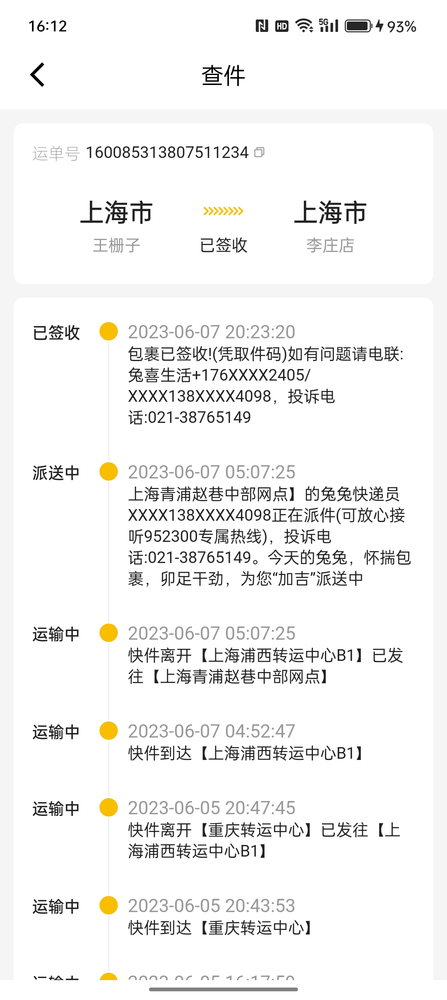
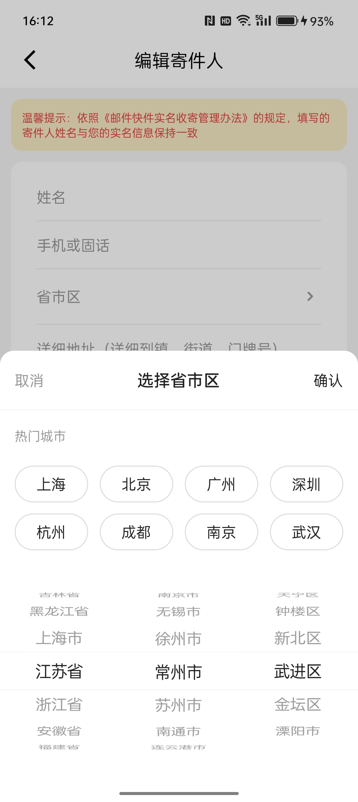
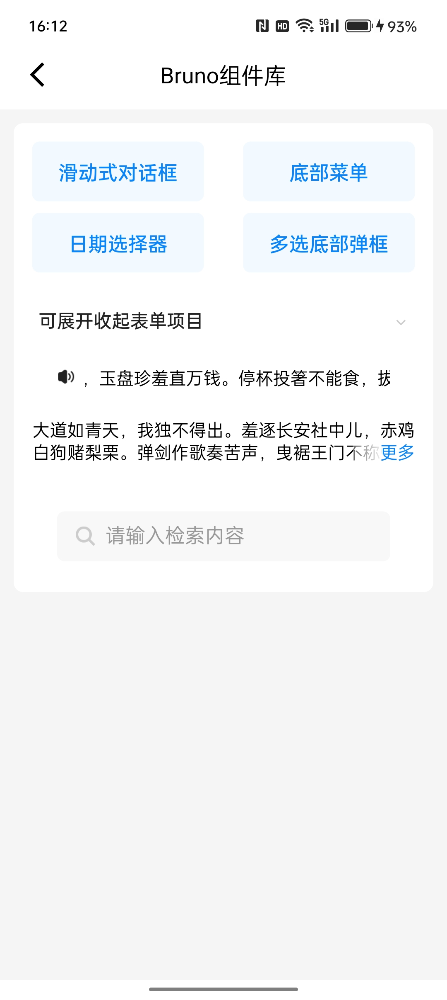

# FlutterHybird
本工程是基于flutter_boost框架开发的，运行在Android平台上的flutter与原生混合开发的，安装包存放于工程apk目录下的<u>**迅达.apk**</u>
#### 编译环境
flutter_boost版本： **4.2.1**  

Flutter版本：**3.3**

AndroidStudio版本：**4.1.2**

运行方式：AndroidStudio直接打开BoostTestAndroid

#### 运行环境
* android真机
#### 功能点

* 该工程使用flutter大部分组件，如：图片组件，按钮组件，布局组件，滑动组件，列表组件等等
* 该工程实现了flutter与原生相互通信的功能，原生可以通过入参控制App首页
* 该工程也实现了各种对话框，如底部对话框，省市区选择对话框(自定义的，比较复杂)
* 该工程也集成了很多优秀的第三份库，如：flutter_screenutil(屏幕适配库)，dio(网络请求库)，bruno(flutter 组件库)，FlutterBoost组件
* bruno使用方便，功能强大，包含了flutter工作中常用的大部分组件，推荐使用
* FlutterBoost是一个Flutter插件，它可以轻松地为现有原生应用程序提供Flutter混合集成方案。FlutterBoost的理念是将Flutter像Webview那样来使用。在现有应用程序中同时管理Native页面和Flutter页面并非易事。 FlutterBoost帮你处理页面的映射和跳转，你只需关心页面的名字和参数即可
#### 运行效果(工程根目录images文件夹)

